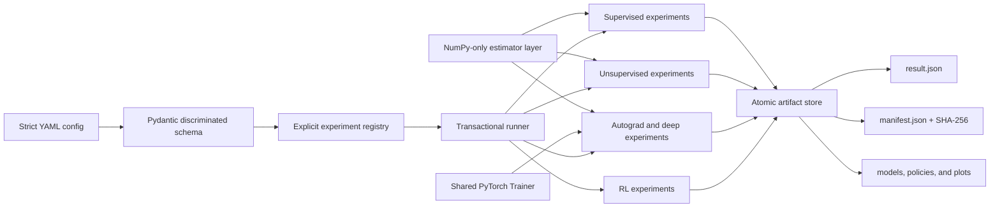

# Learning Systems Atlas

**Signal. Structure. Strategy.**

[](https://github.com/srgangaram-swe/learning-systems-atlas/actions/workflows/ci.yml)

[](LICENSE)

Learning Systems Atlas is a reproducible, production-grade portfolio of
implemented supervised, unsupervised, deep, and reinforcement learning systems,
with milestone-backed plans for generative AI, proof-linked classical
algorithms, and distributed ML systems.
It connects mathematical foundations and classical estimators to decision
policies, evidence, and production engineering practice without claiming future
milestones as complete.

The project is organized around evidence rather than isolated demos. Every
reference experiment has a typed configuration, explicit seed streams, a
declared selection/evaluation boundary, versioned artifacts, diagnostics, and
unit plus integration tests. Supervised and RL studies include naive baselines;
unsupervised studies expose internal criteria and retrospective truth separately.
Production logic lives in a typed `src` package; notebooks are reserved for later
presentation layers.

> [!NOTE]
> This is a personal engineering and research portfolio built entirely from
> bundled, synthetic, or openly documented sources. It contains no employer or
> proprietary data and does not represent any employer.

## Latest evidence — deep-learning systems

Sprint 4 connects first principles to production-shaped PyTorch practice. A
NumPy-only reverse-mode autodiff engine supports a from-scratch multilayer
perceptron; the shared PyTorch layer adds deterministic CPU training,
validation-based early stopping, finite-value guards, atomic checkpoint
publication, restricted loading, exact resume, and common objectives
for a compact CNN, packed LSTM, and bottleneck autoencoder.

All four committed studies use a three-way boundary: training fits parameters,
validation selects candidates or stopping state, and the test split is opened
only after selection. The public `benchmark-deep` workflow publishes the four
runs and aggregate reports as one transaction. Its seed-42 CPU reference
produces 15 diagnostic plots and the following observed evidence:

| Study | Validation selection evidence | Untouched-test evidence | Failure-revealing evidence |
|---|---:|---:|---:|
| From-scratch MLP | mean accuracy `1.000` vs logistic `0.5938` | mean accuracy `1.000` vs logistic `0.600` | maximum gradient error `1.5634e-9` |
| Vision | CNN `0.9793` vs MLP `0.9637` | CNN `0.9707` vs MLP `0.9414` | mistakes and learned first-layer filters |
| Sequence | LSTM `1.000` vs padded MLP `0.5052` | LSTM `1.000` vs padded MLP `0.5625` | appended-padding logit delta `0.0000` |
| Anomaly/representation | autoencoder and PCA AUROC `1.000`; autoencoder wins declared tie-break | both test AUROC `1.000` | error ratios `9.4343` vs `7.4342`; latent silhouette `0.1947` |

Perfect scores here characterize deliberately compact reference tasks, not
frontier capability. The sequence dependency is synthetic; anomalies are
injected corruptions; digits are the small bundled 8×8 dataset; and every
headline number comes from one seed, split, and CPU profile. No accelerator,
multi-node, foundation-model, or state-of-the-art claim follows from them.

<table>
  <tr>
    <td></td>
    <td></td>
  </tr>
  <tr>
    <td align="center">Nonlinear XOR and two-moons decisions backed by finite-difference gradients</td>
    <td align="center">Shared Trainer trajectories for the image candidates</td>
  </tr>
  <tr>
    <td></td>
    <td></td>
  </tr>
  <tr>
    <td align="center">Long-range performance is stratified by true sequence length</td>
    <td align="center">Autoencoder and PCA anomaly ranking on the untouched test split</td>
  </tr>
  <tr>
    <td></td>
    <td></td>
  </tr>
  <tr>
    <td align="center">Per-class image errors remain visible</td>
    <td align="center">A modest retrospective silhouette tempers visual interpretation</td>
  </tr>
</table>

See the [complete Sprint 4 result gallery](docs/results.md) and
[Sprint 4 mathematical and engineering notes](docs/sprint-04.md).

## Sprint 3 evidence — from-scratch unsupervised systems

Sprint 3 adds a NumPy-only structure-discovery and representation-learning
stack: k-means++, full-covariance Gaussian-mixture EM, DBSCAN, four
agglomerative linkages, thin-SVD PCA, and exact t-SNE. The locked seed-42
profile compares seven clustering strategies across four heterogeneous
geometries and two representations on a six-dimensional source.

Labels are structurally excluded from fitting and selection. Clustering is
selected with silhouette, assigned coverage, and named perturbation stability;
representations are selected with neighborhood preservation and distance
correlation. ARI, NMI, and truth-colored panels are calculated only after each
winner is fixed.

Stability aggregates three named perturbation refits on each of four datasets
(12 trials per candidate). The evidence bundle also retains GMM AIC/BIC,
estimator learned state, DBSCAN and hierarchy diagnostics, t-SNE affinity
calibration, and a 96-trial random-partition ARI audit whose mean is `-0.000510`.

| Study | Selected without labels | Internal evidence | Retrospective evidence |
|---|---|---|---|
| Clustering | k-means++ | score `0.843`; silhouette `0.759`; stability `0.997 ± 0.010`; coverage `1.000` | mean ARI `0.860`; mean NMI `0.835` |
| Representation | t-SNE | score `0.746`; neighbor preservation `0.721`; distance correlation `0.845` | ARI `1.000`; NMI `1.000` |

The clustering result is intentionally not presented as a universal ranking.
Single-link agglomeration obtains retrospective mean ARI `1.000`, while the
label-free objective selects k-means++; that disagreement makes the geometric
bias of internal criteria visible instead of tuning it away with hidden truth.

<table>
  <tr>
    <td></td>
    <td></td>
  </tr>
  <tr>
    <td align="center">Seven methods across convex, non-convex, anisotropic, and variable-density structure</td>
    <td align="center">Named perturbation trials used by label-free selection</td>
  </tr>
  <tr>
    <td></td>
    <td></td>
  </tr>
  <tr>
    <td align="center">Full-covariance density geometry and learned components</td>
    <td align="center">PCA and t-SNE compared with truth used only for retrospective color</td>
  </tr>
  <tr>
    <td></td>
    <td></td>
  </tr>
  <tr>
    <td align="center">Explained variance, singular spectrum, and reconstruction behavior</td>
    <td align="center">A failure-revealing sensitivity study, not a single flattering embedding</td>
  </tr>
</table>

See the [complete 20-plot result gallery](docs/results.md),
[Sprint 3 mathematical and engineering notes](docs/sprint-03.md), and the
accepted [label-free selection decision](docs/adr/0005-label-free-unsupervised-selection.md).

## Sprint 2 evidence — 19 from-scratch supervised candidate configurations

Sprint 2 adds auditable NumPy implementations beneath the experiment layer. The
locked seed-42 profile uses identical training folds, fold-fitted preprocessing,
and one untouched outer holdout per task.

| Task | Compared candidates | Training-only selection | Untouched-test evidence |
|---|---|---|---|
| Regression | mean, OLS/lstsq, OLS/GD, Ridge, Lasso, CART, forest, boosting, k-NN | Ridge: CV RMSE `11.753 ± 0.366` | RMSE `12.638`, R² `0.875`, `64.8%` lower RMSE than mean |
| Classification | prior, logistic, CART, forest, boosting, k-NN, linear/RBF SVM, Gaussian/Multinomial NB | GaussianNB after a deterministic CV tie: macro-F1 `0.931 ± 0.036` | macro-F1 `0.908`, accuracy `90.8%`, Brier `0.091` |

SVM probability metrics are intentionally absent: an uncalibrated decision
margin is not presented as a probability. The from-scratch source boundary is
machine-tested to reject hidden scikit-learn imports.

<table>
  <tr>
    <td></td>
    <td></td>
  </tr>
  <tr>
    <td align="center">Every regression validation fold, not only an aggregate</td>
    <td align="center">Macro-F1 dispersion across ten candidate configurations</td>
  </tr>
  <tr>
    <td></td>
    <td></td>
  </tr>
  <tr>
    <td align="center">Ridge shrinkage and exact Lasso sparsity</td>
    <td align="center">Common projection of six decision surfaces</td>
  </tr>
  <tr>
    <td></td>
    <td></td>
  </tr>
  <tr>
    <td align="center">OOB/holdout agreement and stagewise loss</td>
    <td align="center">ROC, confusion, and descriptive reliability</td>
  </tr>
</table>

See the [complete twelve-plot Sprint 2 gallery](docs/results.md) and
[Sprint 2 mathematical implementation notes](docs/sprint-02.md).

## Sprint 1 cross-paradigm evidence

The locked reference profile uses seed `42` and runs without network access.
These are observed outputs from the committed configs, not target values used
to make the tests pass.

| Paradigm | Candidates | Selection boundary | Held-out/reference evidence |
|---|---|---|---|
| Regression | mean dummy, Ridge, random forest | lowest training-fold CV RMSE | Ridge: R² `0.457`, RMSE `53.63`, `26.8%` lower RMSE than dummy |
| Classification | prior dummy, logistic regression, random forest | highest training-fold CV ROC AUC | Logistic: ROC AUC `0.995`, accuracy `98.2%`, AUC gain `+0.495` over dummy |
| Clustering | k-means, DBSCAN | silhouette × assigned coverage; labels withheld | k-means selection score `0.492`; DBSCAN retrospective ARI `0.983` |
| Reinforcement learning | random policy, tabular Q-learning | exploration-free evaluation stream | Q-learning success `73.5%` (Wilson 95% CI `70.7–76.1%`) vs random `1.3%` |

The clustering result deliberately exposes an important evaluation tension:
silhouette favors convex separation and selects k-means, while withheld labels
show that DBSCAN recovers the non-convex moons far better. The external labels
are never available to fitting or model selection.

<table>
  <tr>
    <td></td>
    <td></td>
  </tr>
  <tr>
    <td align="center">Regression: prediction, residual structure, and error distribution</td>
    <td align="center">Classification: ROC, confusion matrix, and calibration</td>
  </tr>
  <tr>
    <td></td>
    <td></td>
  </tr>
  <tr>
    <td align="center">Unsupervised assignments with truth shown only retrospectively</td>
    <td align="center">Random-policy and Q-learning evaluation with Wilson intervals</td>
  </tr>
</table>

See the complete [reference results and plot gallery](docs/results.md).

## What is implemented

| Area | Current implementation | Planned breadth |
|---|---|---|
| Core math/API | fitted-state contracts; finite/shape/dtype validation; metrics; truth-bearing generators; seeded split/fold utilities; preprocessing | calibration, uncertainty, optimization extensions |
| Supervised | from-scratch OLS/GD, Ridge/Lasso, logistic, CART, forests, boosting, k-NN, kernel SVM, Gaussian/Multinomial NB; production-library references | calibration, uncertainty, large-scale solvers |
| Unsupervised | from-scratch k-means++, full-covariance GMM/EM, DBSCAN, single/complete/average/Ward agglomeration, PCA/SVD, exact t-SNE; label-free selection and retrospective truth | spectral clustering, matrix factorization, UMAP, contrastive and self-supervised representations |
| Deep learning | NumPy reverse-mode autograd and MLP; deterministic checkpointable PyTorch Trainer; CNN, packed LSTM, and bottleneck autoencoder studies; validation-only selection and 15 diagnostic plots | larger datasets, calibration, augmentation, transformers, multi-accelerator execution |
| Reinforcement learning | tabular Q-learning, random baseline, isolated policy evaluation | bandits, dynamic programming, SARSA, REINFORCE, DQN |
| Algorithms | proof/benchmark platform and 15 comprehensive work items defined | sorting/search, structures, DP/greedy, graphs, strings, geometry, Fox matrix multiplication, randomized/approximation |
| ML systems | locked environments, named random streams, manifests, hashes, transactional artifacts, CI matrix | Sprint 8: distributed data/collectives, DDP, FSDP2/ZeRO, model parallelism, checkpoint/recovery, orchestration, observability, cost, security |
| Generative AI | Sprint 9 architecture and 24 assigned work items defined | autoregressive and diffusion families, adaptation, evaluation, inference, safety, and single-/distributed-device execution |

Generative AI and distributed scale remain planned milestones; the repository
does not present their designs as implemented systems or measured capability.

## Five-minute start

Prerequisites: Git and Python `3.11`, `3.12`, or `3.13`. Install
[`uv`](https://docs.astral.sh/uv/getting-started/installation/), then:

```bash
git clone https://github.com/srgangaram-swe/learning-systems-atlas.git
cd learning-systems-atlas
uv sync --locked --all-groups
uv run learning-atlas list
uv run learning-atlas run-all --config-dir configs --output-dir runs/quickstart
```

Each experiment publishes a self-contained directory with a resolved config,
result, manifest, model/policy state, checksums, and plots. Existing non-empty
output directories are never overwritten.

Useful commands:

```bash
uv run learning-atlas validate configs/supervised/classification.yaml
uv run learning-atlas schema
uv run learning-atlas benchmark-supervised -c configs/supervised/sprint-02 -o runs/sprint-02
uv run learning-atlas benchmark-unsupervised -c configs/unsupervised/sprint-03 -o runs/sprint-03
uv run learning-atlas benchmark-deep -c configs/deep/sprint-04 -o runs/sprint-04
uv run learning-atlas run configs/reinforcement/q_learning.yaml -o runs/frozen-lake
make check
```

## Architecture



The shared boundary is `Experiment.run(RunContext) -> RunResult`. Paradigms keep
their native interfaces—inductive supervised estimators, inductive or explicitly
transductive unsupervised models, tensor computation graphs and PyTorch modules,
and a Bellman-update RL agent—instead of being forced into an artificial common
hierarchy. The NumPy estimator layers share fitted-state, finite-input,
feature-count, and deterministic-seed contracts.

Read [architecture](docs/architecture.md),
[reproducibility](docs/reproducibility.md), and the
[architecture decisions](docs/adr/) for the tradeoffs.

## Scientific and engineering controls

- Preprocessing is fit inside pipelines after train/test separation.
- Regression and classification winners are chosen using training-fold CV;
  held-out scores never select a model.
- Unsupervised fitting and selection receive features only. Labels are reserved
  for retrospective ARI/NMI and truth-colored evidence after selection is fixed.
- Named candidate, restart, perturbation, and sensitivity streams make
  unsupervised results repeatable and isolate existing candidates from reordering.
- Deep candidates use named initialization and Trainer streams, validation-only
  selection, deterministic CPU kernels, safe checkpoint schemas, and exact
  checkpoint-resume tests. Test metrics cannot select a candidate.
- RL uses separately derived policy, transition, training, and evaluation seeds;
  true termination and time-limit truncation have distinct Bellman semantics.
- Results reject NaN/inf, declare only existing in-scope artifacts, and publish
  atomically after full validation.
- Tests assert learning relative to naive baselines with stable margins rather
  than brittle exact floating-point goldens.
- From-scratch numerical modules cannot import scikit-learn; hand fixtures,
  algebraic properties, and independent differential oracles test correctness.
- The committed lock covers macOS/Linux resolution; CI tests Python 3.11–3.13
  on immutable action revisions and an explicit Ubuntu runner.

The local gate includes strict Ruff formatting/linting, strict mypy,
unit/integration/property tests, an explicit raw branch-edge coverage floor of
`90%`, lock verification, and wheel/sdist builds. CI runs the complete suite
across all supported Python versions.

## Roadmap and branching

The repository has nine assigned milestones and 103 scoped work items:

1. [Foundations and three-paradigm vertical slice](https://github.com/srgangaram-swe/learning-systems-atlas/milestone/1)
2. [Trees, ensembles, and margins](https://github.com/srgangaram-swe/learning-systems-atlas/milestone/2)
3. [Unsupervised learning](https://github.com/srgangaram-swe/learning-systems-atlas/milestone/3)
4. [Deep learning](https://github.com/srgangaram-swe/learning-systems-atlas/milestone/4)
5. [Reinforcement learning](https://github.com/srgangaram-swe/learning-systems-atlas/milestone/5)
6. [Benchmarks, documentation, and v1.0](https://github.com/srgangaram-swe/learning-systems-atlas/milestone/6)
7. [Algorithms, proofs, and performance](https://github.com/srgangaram-swe/learning-systems-atlas/milestone/14)
8. [Distributed ML systems and scale engineering](https://github.com/srgangaram-swe/learning-systems-atlas/milestone/15)
9. [Generative AI & foundation model systems](https://github.com/srgangaram-swe/learning-systems-atlas/milestone/16)

Feature branches are cut from `dev`, validated through pull requests, and
deleted after merge. Release candidates flow `dev → main → prod`. See
[CONTRIBUTING.md](CONTRIBUTING.md) and the detailed [roadmap](docs/roadmap.md).

## Honest limitations

- Reference profiles use small bundled/synthetic problems for deterministic CPU CI; they
  demonstrate methodology and system design, not state-of-the-art claims.
- Sprint 4 reports one seed and one split per compact CPU study. Its temporal
  dependency and anomaly corruptions are synthetic, and perfect AUROC/accuracy
  must not be generalized to natural, adversarial, or distribution-shifted data.
- The kernel SVM is intentionally a small/medium binary solver with quadratic
  kernel storage; the NumPy CART/ensembles optimize auditability before scale.
- Floating-point values can vary slightly across BLAS, platforms, and library
  releases even with identical seeds and dependency resolution.
- The Wisconsin diagnostic dataset is appropriate for a technical benchmark,
  not a deployable clinical model. No clinical-use claim is made.
- Joblib artifacts must never be loaded from untrusted sources. The manifest
  hashes detect drift but do not make pickle-based formats safe.
- Distributed training and scale engineering have a scoped Sprint 8 milestone,
  but no cluster-speedup, accelerator, model-serving, or monitoring implementation
  is implied by the current repository state.
- Generative AI has a scoped Sprint 9 milestone, but no language, diffusion,
  multimodal, retrieval, or frontier-scale model is claimed as implemented yet.

## License

[MIT](LICENSE) © 2026 Saif Ryan Gangaram
