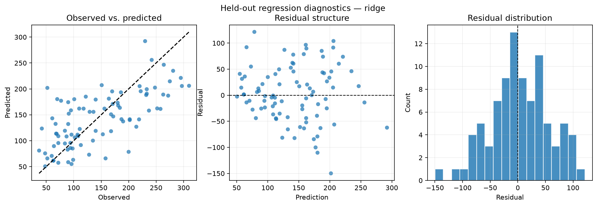
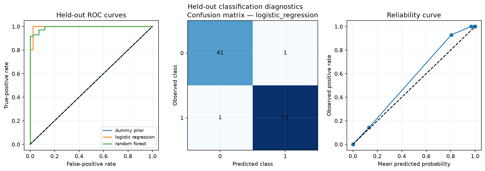
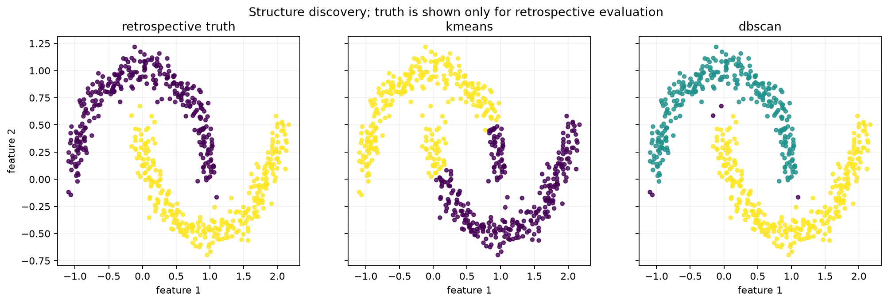
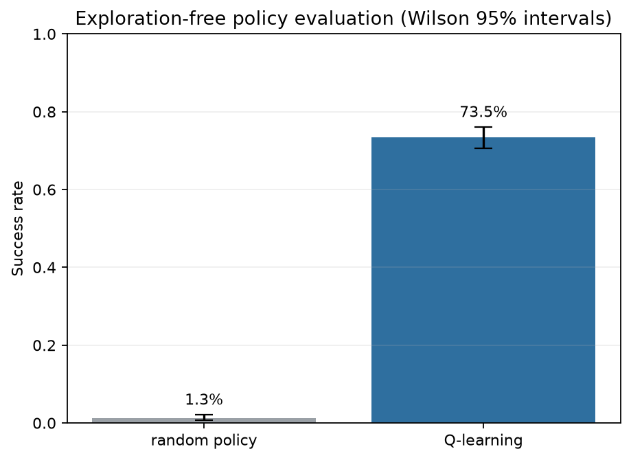
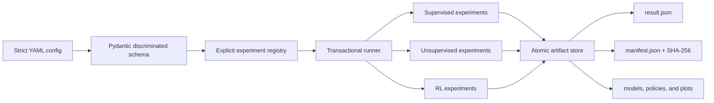

# Learning Systems Atlas

**Signal. Structure. Strategy.**

[](https://github.com/srgangaram-swe/comprehensive_ml/actions/workflows/ci.yml)


[](LICENSE)

Learning Systems Atlas is a reproducible, production-grade portfolio of
supervised, unsupervised, deep, and reinforcement learning systems—from
mathematical foundations and classical estimators to neural models and decision
policies.

The project is organized around evidence rather than isolated demos. Every
reference experiment has a typed configuration, explicit seed streams,
leakage controls, a naive baseline, held-out evaluation, versioned artifacts,
diagnostic plots, and unit plus integration tests. Production logic lives in a
typed `src` package; notebooks are reserved for later presentation layers.

> [!NOTE]
> This is a personal engineering and research portfolio built entirely from
> bundled, synthetic, or openly documented sources. It contains no employer or
> proprietary data and does not represent any employer.

## Sprint 1 evidence

The locked reference profile uses seed `42` and runs without network access.
These are observed outputs from the committed configs, not target values used
to make the tests pass.

| Paradigm | Candidates | Selection boundary | Held-out/reference evidence |
|---|---|---|---|
| Regression | mean dummy, Ridge, random forest | lowest training-fold CV RMSE | Ridge: R² `0.457`, RMSE `53.63`, `26.8%` lower RMSE than dummy |
| Classification | prior dummy, logistic regression, random forest | highest training-fold CV ROC AUC | Logistic: ROC AUC `0.995`, accuracy `98.2%`, AUC gain `+0.495` over dummy |
| Clustering | k-means, DBSCAN | silhouette × assigned coverage; labels withheld | k-means selection score `0.492`; DBSCAN retrospective ARI `0.983` |
| Reinforcement learning | random policy, tabular Q-learning | exploration-free evaluation stream | Q-learning success `73.5%` (Wilson 95% CI `70.7–76.1%`) vs random `1.3%` |

The clustering result deliberately exposes an important evaluation tension:
silhouette favors convex separation and selects k-means, while withheld labels
show that DBSCAN recovers the non-convex moons far better. The external labels
are never available to fitting or model selection.

<table>
  <tr>
    <td></td>
    <td></td>
  </tr>
  <tr>
    <td align="center">Regression: prediction, residual structure, and error distribution</td>
    <td align="center">Classification: ROC, confusion matrix, and calibration</td>
  </tr>
  <tr>
    <td></td>
    <td></td>
  </tr>
  <tr>
    <td align="center">Unsupervised assignments with truth shown only retrospectively</td>
    <td align="center">Random-policy and Q-learning evaluation with Wilson intervals</td>
  </tr>
</table>

See the complete [Sprint 1 result and plot gallery](docs/results.md).

## What is implemented

| Area | Current implementation | Planned breadth |
|---|---|---|
| Core math/API | fitted-state estimator contract, regressor/classifier scoring mixins, finite/shape/dtype validation | metrics, datasets, optimizers, calibration, uncertainty |
| Supervised | regularized linear and tree-ensemble regression; logistic and tree-ensemble classification; dummy baselines | OLS/GD, Lasso, CART, forests, boosting, k-NN, SVMs, Naive Bayes |
| Unsupervised | k-means and DBSCAN comparison with label-isolated evaluation | GMM/EM, hierarchical clustering, PCA/SVD, t-SNE, representation learning |
| Deep learning | architecture and work items defined | reverse-mode autograd, MLP, PyTorch engine, CNN, LSTM, autoencoder |
| Reinforcement learning | tabular Q-learning, random baseline, isolated policy evaluation | bandits, dynamic programming, SARSA, REINFORCE, DQN |
| ML systems | locked environments, manifests, hashes, transactional artifacts, CI matrix | tracking, validation, serving, monitoring, release automation |

Deep learning is intentionally listed as planned until its tested milestone is
merged; the repository does not claim implementations that do not yet exist.

## Five-minute start

Prerequisites: Git and Python `3.11`, `3.12`, or `3.13`. Install
[`uv`](https://docs.astral.sh/uv/getting-started/installation/), then:

```bash
git clone https://github.com/srgangaram-swe/comprehensive_ml.git
cd comprehensive_ml
uv sync --locked --all-groups
uv run learning-atlas list
uv run learning-atlas run-all --config-dir configs --output-dir runs/quickstart
```

Each experiment publishes a self-contained directory with a resolved config,
result, manifest, model/policy state, checksums, and plots. Existing non-empty
output directories are never overwritten.

Useful commands:

```bash
uv run learning-atlas validate configs/supervised/classification.yaml
uv run learning-atlas schema
uv run learning-atlas run configs/reinforcement/q_learning.yaml -o runs/frozen-lake
make check
```

## Architecture



The shared boundary is `Experiment.run(RunContext) -> RunResult`. Paradigms keep
their native interfaces—sklearn pipelines for supervised/clustering models and
an explicit Bellman-update agent for RL—instead of being forced into an
artificial common `fit/predict` hierarchy. From-scratch supervised estimators
have a separate fitted-state and validation contract.

Read [architecture](docs/architecture.md),
[reproducibility](docs/reproducibility.md), and the
[architecture decisions](docs/adr/) for the tradeoffs.

## Scientific and engineering controls

- Preprocessing is fit inside pipelines after train/test separation.
- Regression and classification winners are chosen using training-fold CV;
  held-out scores never select a model.
- Clustering receives features only. Labels are reserved for retrospective ARI/NMI.
- RL uses separately derived policy, transition, training, and evaluation seeds;
  true termination and time-limit truncation have distinct Bellman semantics.
- Results reject NaN/inf, declare only existing in-scope artifacts, and publish
  atomically after full validation.
- Tests assert learning relative to naive baselines with stable margins rather
  than brittle exact floating-point goldens.
- The committed lock covers macOS/Linux resolution; CI tests Python 3.11–3.13
  on immutable action revisions and an explicit Ubuntu runner.

The local gate currently includes strict Ruff formatting/linting, strict mypy,
`110+` unit/integration tests, branch coverage ≥90%, lock verification, and
wheel/sdist builds. CI runs the complete suite across all supported Python versions.

## Roadmap and branching

The repository has six assigned milestones and 43 scoped work items:

1. [Foundations and three-paradigm vertical slice](https://github.com/srgangaram-swe/comprehensive_ml/milestone/1)
2. [Trees, ensembles, and margins](https://github.com/srgangaram-swe/comprehensive_ml/milestone/2)
3. [Unsupervised learning](https://github.com/srgangaram-swe/comprehensive_ml/milestone/3)
4. [Deep learning](https://github.com/srgangaram-swe/comprehensive_ml/milestone/4)
5. [Reinforcement learning](https://github.com/srgangaram-swe/comprehensive_ml/milestone/5)
6. [Benchmarks, documentation, and v1.0](https://github.com/srgangaram-swe/comprehensive_ml/milestone/6)

Feature branches are cut from `dev`, validated through pull requests, and
deleted after merge. Release candidates flow `dev → main → prod`. See
[CONTRIBUTING.md](CONTRIBUTING.md) and the detailed [roadmap](docs/roadmap.md).

## Honest limitations

- Sprint 1 uses small bundled/synthetic problems for deterministic CPU CI; it
  demonstrates methodology and system design, not state-of-the-art claims.
- Floating-point values can vary slightly across BLAS, platforms, and library
  releases even with identical seeds and dependency resolution.
- The Wisconsin diagnostic dataset is appropriate for a technical benchmark,
  not a deployable clinical model. No clinical-use claim is made.
- Joblib artifacts must never be loaded from untrusted sources. The manifest
  hashes detect drift but do not make pickle-based formats safe.
- GPU reproducibility, distributed training, model serving, and monitoring are
  future milestones and are not implied by the current release.

## License

[MIT](LICENSE) © 2026 Saif Ryan Gangaram
