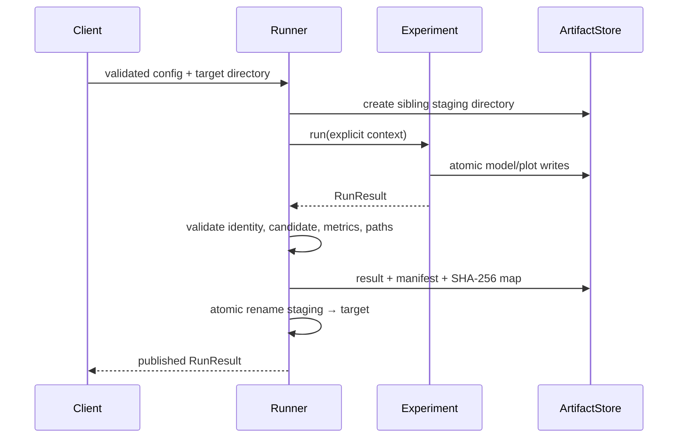

# Architecture

Learning Systems Atlas separates scientific concerns from execution and
presentation concerns. The package boundary is the primary interface; configs,
the CLI, and future notebooks are clients.

## Dependency direction

```text
core ────────────────┐
  ▲                  │
  ├── supervised ────┤
  ├── unsupervised ──┼── workflows ── CLI
  └── reinforcement ─┤
                     ▼
                  reporting
```

| Package | Responsibility | Must not own |
|---|---|---|
| `core` | config schemas, experiment/result contracts, validation, provenance, runner, artifacts | paradigm-specific training logic |
| `supervised` | split-safe regression/classification pipelines and evaluation | CLI or filesystem orchestration |
| `unsupervised` | feature-only fitting, internal selection, retrospective external metrics | using targets in fit/selection |
| `reinforcement` | agent update, exploration schedule, environment interaction, policy evaluation | global random state or training/evaluation coupling |
| `reporting` | deterministic plot publication | model selection or metric computation |
| `workflows` | multi-config orchestration and suite-level transaction | domain algorithms |
| `cli` | user input/output and exit-code mapping | training implementation |

## Deliberately small shared contract

The common paradigm boundary is:

```python
class Experiment(Protocol):
    def run(self, context: RunContext) -> RunResult: ...
```

`RunResult` is a versioned, JSON-safe scientific record: experiment identity,
paradigm, seed, source identity, selected candidate, deterministic metrics,
artifact paths, and limitations. Volatile timing and environment provenance
live in `manifest.json`, so two identical runs can produce identical result and
model/plot hashes while still recording observed runtime.

From-scratch supervised models use a separate `Estimator` contract with
fitted-state checking, feature-count enforcement, regressor/classifier scoring,
and centralized finite numerical validation. It is intentionally not imposed
on clustering algorithms or RL agents.

## Execution transaction



Failures remove staging state. A non-empty target is never overwritten. The
multi-experiment workflow preflights every config and duplicate name before it
starts, then publishes the entire suite with the same transaction pattern.

## Configuration and discovery

YAML is parsed with `safe_load`, then a strict Pydantic discriminated union
rejects coercion, unknown keys, invalid ranges, and inconsistent cross-field
values. The explicit registry maps each discriminator to a typed factory and
discoverable description. Dynamic import strings and configuration-driven code
execution are excluded.

## Extension checklist

A new experiment must include:

1. A strict config model and committed quick profile.
2. A paradigm-native implementation behind `Experiment`.
3. A naive or established baseline and leakage-safe selection boundary.
4. Deterministic metrics plus meaningful plots/model artifacts.
5. Unit tests for numerical/error paths and an end-to-end integration test.
6. Source identity, assumptions, limitations, and an exact reproduction command.

See [ADR-0001](adr/0001-paradigm-native-experiments.md) and
[ADR-0002](adr/0002-transactional-local-artifacts.md).
