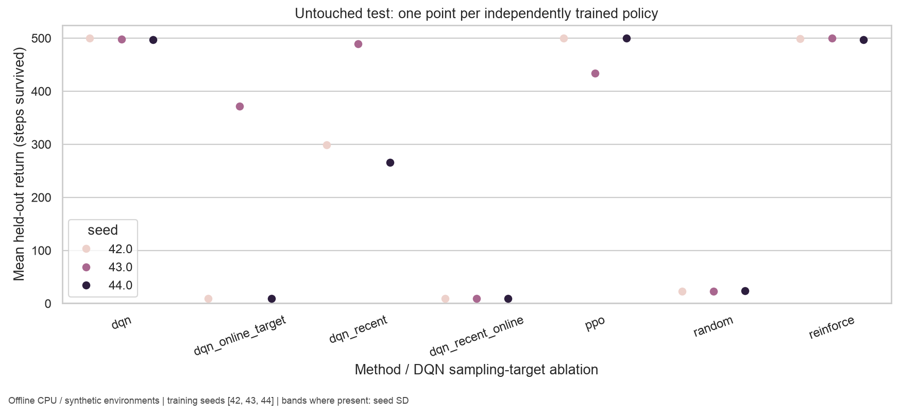
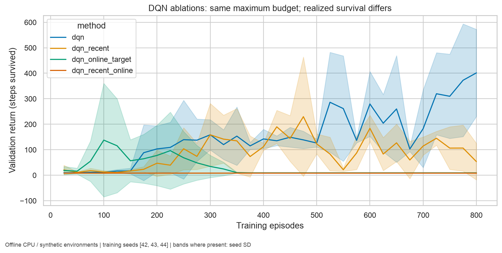
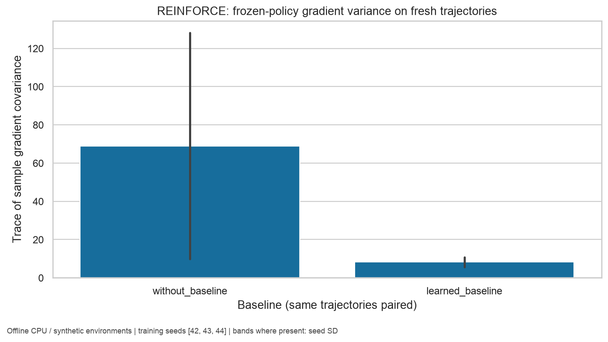

# Sprint 5: reinforcement-learning findings

The reference implements and tests the complete planned RL sequence: bandits,
an exact Gridworld model, dynamic programming, temporal-difference control,
REINFORCE, DQN, and PPO-Clip/GAE. The experiments measure how exploration,
validation selection, and unstable bootstrapping affect learned policies.

## Reference and reproduction

The run used clean source commit
`f4c2d9c8b3f8b3663ea0839310dabef801b5a0f2`, CPython 3.13.11,
macOS 15.5 arm64, Torch 2.13.0, NumPy 2.4.6, and Gymnasium 1.3.0.
It took 455.22 seconds of wall time on that local CPU environment. This is
one measured run, not a hardware-normalized throughput benchmark.

```bash
uv sync --locked --all-groups
uv run learning-atlas benchmark-reinforcement \
  configs/reinforcement/sprint-05/reinforcement.yaml \
  --output-dir runs/sprint-05
```

[Configuration](assets/sprint-05/resolved_config.json),
[evidence tables](assets/sprint-05/evidence.json),
[comparison CSV](assets/sprint-05/comparison.csv), and
[environment/hash manifest](assets/sprint-05/manifest.json) contain the full record.
The evidence SHA-256 is
`d25bf7313f60168e3f301dfd545d93ed5e8f815de7af848034dc2f578f2c4357`.
All 25 artifact hashes were verified after export, and all 20 figures were
visually inspected. The export contains 7,557,591 bytes of synthetic aggregates,
plots, and metadata; it contains no checkpoints or model weights.

## What the control results support

Each neural method has three training seeds (42, 43, 44), ten validation
episodes per checkpoint, and 100 untouched test episodes per selected policy.
REINFORCE has a 2,000-episode training budget, DQN 800, and PPO 300.
The test stream never updates parameters or chooses a checkpoint.

| Method | Mean test return | Training-seed SD | Seeds >=475/500 |
|---|---:|---:|---:|
| REINFORCE | 498.73 | 1.41 | 3/3 |
| DQN | 498.19 | 1.78 | 3/3 |
| DQN, recent-window sampling | 351.14 | 120.55 | 1/3 |
| DQN, online targets | 130.19 | 209.43 | 0/3 |
| DQN, recent-window sampling and online targets | 9.29 | 0.04 | 0/3 |
| PPO | 478.03 | 38.05 | 2/3 |
| Random policy | 23.25 | 0.67 | 0/3 |

REINFORCE and DQN met the CartPole criterion on every reference seed. PPO's
weaker seed matters: its selected checkpoint scored 500 on validation but
434.09 on the untouched test stream. The other two PPO seeds scored 500.
No tuning followed that observation. More independent training seeds and a
larger validation panel belong in a later experiment with a fresh holdout.



DQN's selected checkpoints performed well even though later validation returns
fluctuated. Removing the frozen target network produced large finite TD losses
and poor policies. Gradient clipping and finite-value checks did not establish
convergence. The ablations hold episode ceilings and update settings fixed,
but early failure reduces realized transitions; the comparison therefore does
not isolate a causal effect at identical data volume.



PPO and DQN used roughly 79,000 to 103,000 interactions per seed. REINFORCE
used 715,307 to 809,217. Episode-indexed learning curves alone would obscure
this difference. The reference reports both consumed transitions and maximum
budgets, and the interaction-indexed plot retains individual seed trajectories.

## What the baseline and tabular studies add

The frozen-policy REINFORCE assay compares paired fresh trajectories with and
without the already learned baseline. Across 32 trajectories per seed, the
baseline/no-baseline gradient-variance ratios were 0.05584, 0.20958, and 0.31353.
That is a measured reduction of 94.4%, 79.0%, and 68.6%, respectively. The assay
uses the trace of sample gradient covariance, not loss or gradient magnitude as
a substitute for variance. A learned baseline need not improve every policy.



Both tabular methods recovered the optimal navigation start-state value on
all three seeds. On the cliff task, the final 250 training episodes averaged
0.3653 falls per episode for Q-learning and 0.0680 for SARSA under epsilon=0.1
exploration. SARSA's mean return was -40.20 versus -52.14. Its final greedy
policies were weaker against the exact discounted optimum, including a
10.81-value gap for seed 44. Lower exploratory risk does not imply a better
greedy policy.

On the stochastic navigation model, value iteration ended after 21 updates
with residual `4.5800e-10`; policy iteration ended after two improvements with
residual `1.7764e-15`. The [proof](proofs/discounted-mdp-planning.md) states the
discounted finite-MDP assumptions separately from the numerical tests.

Bandit results also resist a single ranking. Mean 2,000-step Bernoulli
pseudo-regret was 11.60 for Thompson sampling, 100.40 for UCB, and 122.67 for
epsilon-greedy. On the Gaussian fixture, epsilon-greedy had the lowest observed
mean regret at 86.53, versus 109.20 for UCB and 111.27 for Thompson sampling.
These finite-horizon observations do not overturn asymptotic regret theory or
establish a universal winner.

## Plot inventory and interpretation

| Plot | Question answered |
|---|---|
| [Bernoulli regret](assets/sprint-05/plots/bernoulli_regret.png) | How much expected reward did each exploration method forgo? |
| [Gaussian regret](assets/sprint-05/plots/gaussian_regret.png) | Does the observed ranking survive a noisier reward family? |
| [Realized bandit rewards](assets/sprint-05/plots/bandit_rewards.png) | Do actual reward trajectories support the regret interpretation? |
| [Thompson posteriors](assets/sprint-05/plots/bandit_posteriors.png) | Which arms remain uncertain or poorly estimated? |
| [Bellman residuals](assets/sprint-05/plots/planning_residuals.png) | Did each planner meet its numerical stopping certificate? |
| [Grid value and policy](assets/sprint-05/plots/gridworld_policy.png) | Do values and actions agree with the geometry and slip model? |
| [Navigation learning](assets/sprint-05/plots/navigation_learning.png) | Did tabular control learn the route? |
| [Cliff learning](assets/sprint-05/plots/cliff_learning.png) | How does exploratory risk affect realized return? |
| [Cliff falls](assets/sprint-05/plots/cliff_risk.png) | Does SARSA reduce falls under the behavior policy? |
| [Exact-DP policy gaps](assets/sprint-05/plots/tabular_policy_gap.png) | What does that behavior cost under greedy evaluation? |
| [Neural training](assets/sprint-05/plots/neural_learning.png) | How does return change within each declared episode budget? |
| [Neural validation](assets/sprint-05/plots/neural_validation.png) | Are later checkpoints reliably better? |
| [Test seed means](assets/sprint-05/plots/heldout_seed_means.png) | Which trained policies generalize, and which fail? |
| [Test return ECDF](assets/sprint-05/plots/heldout_return_distribution.png) | Are poor episodes hidden by a mean score? |
| [DQN ablations](assets/sprint-05/plots/dqn_ablation.png) | What changes when replay sampling or targets change? |
| [REINFORCE variance](assets/sprint-05/plots/reinforce_gradient_variance.png) | Does the fitted baseline reduce fresh trajectory-gradient variance? |
| [PPO diagnostics](assets/sprint-05/plots/ppo_optimization.png) | How do KL, clipping, entropy, value error, and post-clipping gradients evolve? |
| [DQN TD loss](assets/sprint-05/plots/dqn_td_loss.png) | Does bootstrapped regression become unstable despite finite gradients? |
| [Interaction cost](assets/sprint-05/plots/interaction_cost.png) | How much environment data did training consume? |
| [Sample efficiency](assets/sprint-05/plots/sample_efficiency.png) | How does validation return relate to actual interactions? |

Shaded bands and bar whiskers show sample SD across training seeds. They can
extend beyond an environment's possible reward range; they are dispersion
summaries, not additional observed returns or confidence bounds. ECDF episodes
are clustered within policies. The JSON's bootstrap intervals resample seed
means and remain fragile with only three seeds.

## Engineering evidence and release state

The full local gate passed 1,101 tests in 111.43 seconds, with 95.26% combined
coverage and 91.39% raw branch coverage against the unchanged 90% floor.
Later runtime-compatibility and publication checks passed their relevant tests;
the final RL subset passed 133 tests with 98.57% combined coverage. Strict mypy
checked 78 source files. Ruff, lock verification, pre-commit, and 0.5.0
wheel/sdist builds passed. The final repository collects 1,116 tests; required
remote CI, rather than this static report, records the final-head matrix result.

Tests include hand calculations, gradient checking, generated MDP properties,
Gymnasium's checker, malformed and oversized checkpoints, failed publication,
exact interrupted/resumed DQN state, test-selection independence, and real
CPU learning over a random policy. Two reduced runs produced identical results
and artifact hashes for all 20 figures and their supporting data.

The dependency audit found no known vulnerabilities in 67 installed third-party
packages. The unpublished local package is outside PyPI advisory matching.
Seaborn 0.13.2, pandas 3.0.5, and platform-conditional tzdata 2026.3 are the
only added locked dependencies; existing dependency versions were preserved.

The work targets `dev` through a reviewed sprint PR. Release closure additionally
requires protected `dev -> prod -> main` promotions and ancestry reconciliation;
this report does not claim those steps or a tagged release are complete.
The [laboratory contract](reinforcement-learning.md) documents recovery,
numerical limits, seed streams, and the absence of live or production actions.
