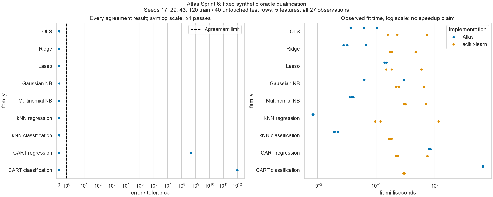

# Sprint 6 — reproducible release evidence

This release adds a strict MkDocs Material site, source-derived public-class API
reference, family cards with implementation-specific complexity bounds, three
executed notebook tours, and an independent numerical/timing qualification report.
No estimator is retuned or replaced to improve a benchmark result. The existing
`Experiment.run(RunContext) -> RunResult` contract is unchanged.

## Reference study

```bash
uv run python scripts/reference_parity.py runs/reference-parity
```

The study fixes nine deterministic model pairs and seeds 17, 29 and 43 before
execution. Each seed supplies 120 training and 40 untouched test rows with five
synthetic features. No candidate is selected, no learned transform sees test data,
and all training/test losses and naive baselines are retained. All 27 observations
are published, including disagreement. Timings are separate machine-dependent
measurements without warmup; they are not a CI performance threshold.

| Comparison | Absolute prediction tolerance | Rationale |
| --- | ---: | --- |
| OLS, Ridge | 1e-10 | Shared dense float64 objective; tolerance permits factorization roundoff |
| Lasso | 1e-7 | Independent coordinate solvers, both requested to stop at 1e-10 |
| Gaussian/Multinomial NB, kNN classification | 1e-12 | Numeric 0/1 labels; requires identical classification |
| kNN regression | 1e-10 | Same neighbors and uniform arithmetic, absent distance ties |
| CART regression | 1e-8 | Strict prediction agreement probe; not guaranteed under tied splits |
| CART classification | 1e-12 | Strict identical-label probe; not guaranteed under tied splits |

**Observed: 25/27 exact prediction comparisons pass.** CART regression seed 43
and CART classification seed 17 disagree on held-out predictions. At the
respective 18-row and 41-row training nodes, different feature thresholds produce
identical training partitions (possibly with left/right reversed). Atlas retains
its deterministic first-feature tie policy; the reference can choose a different
feature. Both produce equivalent training predictions within the declared
tolerance but can extrapolate differently. The report preserves failed test
agreement and all associated losses; tolerances were not enlarged after seeing
these results. The non-blocking CI report job therefore returns a visible
numerical-disagreement result while required invariant tests remain strict.

This corrects the original expectation that every CART fit is numerically
interchangeable. The release criterion is a complete, explained report with strict
oracles for unique solutions and explicit evidence for non-unique tree behavior,
not a fabricated universal parity pass. Stochastic ensembles, clustering, neural
and RL systems retain their existing differential/diagnostic suites; this report
does not claim to qualify their full output distributions.

[Raw observations](assets/sprint-06/observations.json) include environment, training
and test losses, naive losses, all fit/inference timing samples, tolerance and
pass/fail state. The [manifest](assets/sprint-06/manifest.json) binds the bytes.



The left plot uses a symmetric-log scale to retain both zero errors and large
failed tolerance ratios. The threshold stays visible; failed observations are not
clipped. The right plot shows all per-seed fit times, not an aggregate speedup.
The synthetic study is not evidence of generalization to an application domain.

## Documentation and notebook evidence

`python scripts/build_api_reference.py --check` verifies the generated inventory
against every public top-level class in the typed package, without importing or
executing those classes. Mkdocstrings renders their actual API contracts.
Mathematical assumptions, complexity and failure limits are linked from every
class page through the [family cards](model-cards.md).

The seven notebook-profile plots use Seaborn with colorblind palettes, seed context,
explicit cluster/noise legends and high-contrast policy annotations. Numerical
profiles and selection/evaluation semantics are unchanged. Their 34 focused
reference-model/publication and integration tests pass.

All three [notebooks](notebooks.md) executed top-to-bottom with nbclient and per-cell
timeouts. They are output-free, thin clients of existing offline profiles. Their
final discussions preserve training-only selection, label-isolated clustering,
and exploration-free independent policy evaluation respectively.

The site builds strictly with local assets and no remote fonts. A release workflow
uploads and deploys the reviewed Pages artifact from released main; it does not
create a fourth Git branch or commit generated site output. Pull requests receive
read-only permissions and never run a deployment job.

## Validation and remaining limits

Focused parity and release-integration tests pass (21 tests; new reporting module
100% statement and branch coverage). This is not a whole-repository coverage claim.
Existing Python 3.11–3.13 full-suite coverage gates remain mandatory remotely; the
owner requested that the complete suite not be rerun locally. New docs/notebook
checks join the required quality job; only the explicitly diagnostic numerical
parity job is non-blocking. The prior Sprint 5 dev CI was green before this work.

v1.0 establishes a documented research interface and evidence release. It does
not make every model production ready, provide a safety certification, implement
future roadmap milestones, or erase the two measured tree disagreements.
